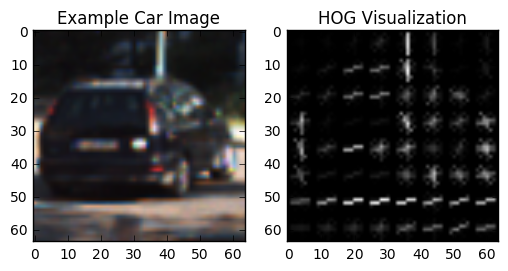
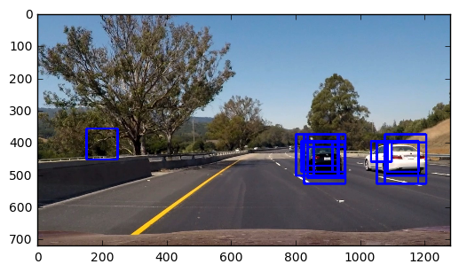
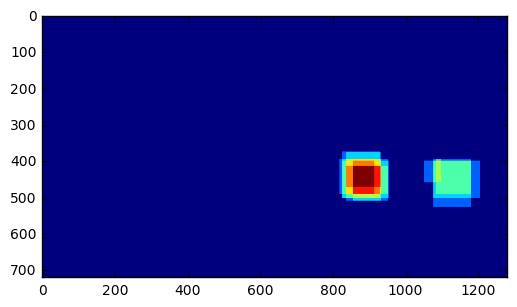
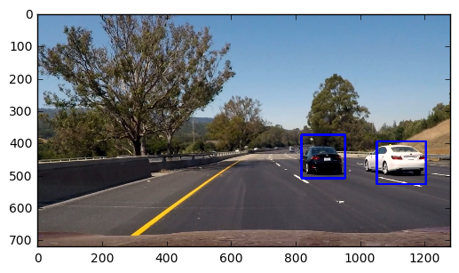

# Vehicle Detection

Code for this project is in VehicleDetection.ipynb notebook.

## Histogram of Oriented Gradients (HOG)

**Explain how (and identify where in your code) you extracted HOG features from the training images. Explain how you settled on your final choice of HOG parameters.**

The code for extracting HOG features is in the section titled **6. Histogram of Oriented Gradients (HOG)**. I experimented with different color spaces and bin sizes. The parameters I ended up using finally:  
Color space: YCrCb  
Orient: 9  
Pixels per cell: 8  
Cells per block: 2  
HOG Channel: ALL 
Histogram bin: 32
Spatial size: 32x32 

I experimented with different color spaces and number of HOG channels. 

Here is an example of of a car image and its HOG visualization.

**Describe how (and identify where in your code) you trained a classifier using your selected HOG features (and color features if you used them).**

I trained my classifier using a Support Vector Machine LinearSVC. I used HOG and color features. The code for my classifier is in the sections titled **9. HOG Classification** and **10. SVM Classifier**.

Here is the output showing the test accuracy of my classifier:    
  
Using: 9 orientations 8 pixels per cell and 2 cells per block  
Feature vector length: 6108  
Test Accuracy of SVC =  0.9893  
My SVC predicts:  [ 1.  0.  1.  1.  1.  1.  0.  0.  0.  0.]  
For these 10 labels:  [ 1.  0.  1.  1.  1.  1.  0.  0.  0.  0.]

## Sliding Window Search

**Describe how (and identify where in your code) you implemented a sliding window search. How did you decide what scales to search and how much to overlap windows?**

The code for the sliding window search is in the section titled **11. Sliding Window**. I experimented with the Y axis start/stop values, the windows sizes and the window overlap. I only search for cars in the bottom half of the image. I use 3 window sizes of 64x64, 96x96 and 128x128 pixels.  I experimented with different window overlap values. If I use a value if 0.8 (80%), I am able to make a tigher bound around the car.

**Show some examples of test images to demonstrate how your pipeline is working. How did you optimize the performance of your classifier?**

I search using the 64x64 window only in the middle of the image since that is where we are likely to find small images of cars. I search using the bigger window sizes in the bottom 3rd of the image.

Image of car with overlapping boxes:

Image of car with heat map:

Image of car with heat map threshold:

Image of car with bounding box:

## Video Implementation

**Provide a link to your final video output. Your pipeline should perform reasonably well on the entire project video (somewhat wobbly or unstable bounding boxes are ok as long as you are identifying the vehicles most of the time with minimal false positives.)**

[Project 5 Output Video](./project_video_output.mp4)

**Describe how (and identify where in your code) you implemented some kind of filter for false positives and some method for combining overlapping bounding boxes.**

I used the techniques decribed in the lessons to handle multiple detections and false positives. I used a heat map to combine overlapping detections. I keep a running sum of the heat map of the previous 10 frames. The threshold value is used to remove false positives - if pixels within a box has been detected less than the threshold number of times, then the box is discarded as a possible car.

## Discussion

**Briefly discuss any problems / issues you faced in your implementation of this project. Where will your pipeline likely fail? What could you do to make it more robust?**

Issues/Problems:

1. The sliding window as currently implemented is very slow.
2. Obtaining a proper balance (with using the heat-map method) between discarding false positives and getting a tight bound on the cars.
3. Likely to have more false positives in high contrast situations.
4. Likely to not detect cars in poor lighting.
5. Likely to fail to detect vehicles other than cars.
6. Likely to fail to detect vehicles if the road is not flat (especially if they are in the top half of the image).

Potential improvement to make the pipeline more robust:  

1. Train with more images of vehicles (cars and other vehicle types).
2. Use different classifiers to improve accuracy.
3. Improve the sliding window search (window sizes and tiling schemes).